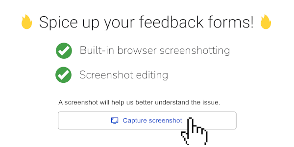
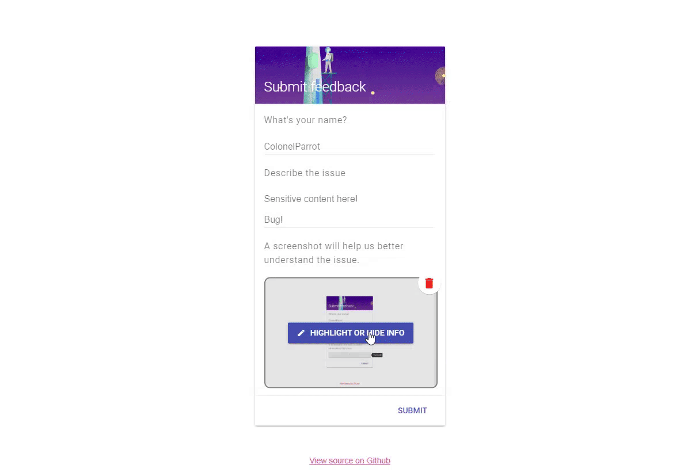

    
     
     
    
    
    
    

     
    
     
     
    

<h2 align="center">Preview (<a href="https://colonelparrot.github.io/feedbackplus/demos/demo.html">try it out!</a>)</h2>

| Taking a Screenshot                           | Editing screenshot                                    |
| --------------------------------------------- | ----------------------------------------------------- |
|  |  |

(click images to enlarge)

<h2 align="center">🔥 Spice up your feedback forms! 🔥</h2>

Want to have better customer engagement for your next site? FeedbackPlus is your solution!

Featuring:

- site screenshotting (uses browser's display API by default, fallbacks to [html2canvas](https://github.com/niklasvh/html2canvas) if available - see [here](https://github.com/ColonelParrot/feedbackplus/wiki#browser-support-bonus))
- built-in screenshot editing (highlight & hide)

<h3 align="center">It's easy to learn, yet extremely powerful!</h3>

Want to learn it? Check our <a href="https://github.com/ColonelParrot/feedbackplus/wiki">documentation!</a>

